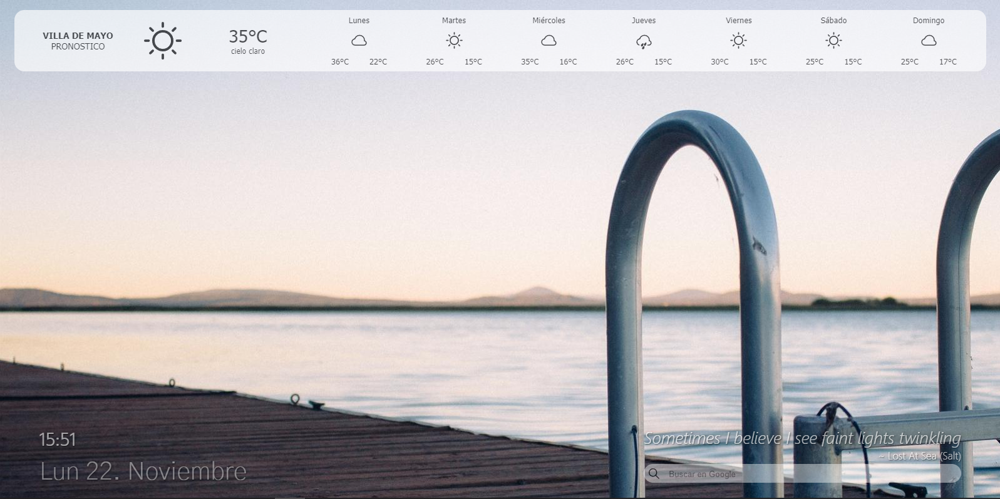

<!-- omit in toc -->
# NaviServer Startpage

Startpage for Navi Server. Simple and fast

- [1. Description](#1-description)
- [2. Preview](#2-preview)
- [3. Build](#3-build)
- [4. Deployment](#4-deployment)
- [5. Support](#5-support)
- [6. Roadmap](#6-roadmap)
- [7. Contributing](#7-contributing)
- [8. Authors and acknowledgment](#8-authors-and-acknowledgment)
- [9. License](#9-license)

## 1. Description

Clone this repository to learn, modify or implement a simple startpage in your system.

This project born to use in the Navi Server like domain's startpage.
This startpage show a random background fantasy images, with a digital clock, a weatherboard and a motivational quote.

## 2. Preview



## 3. Build

This project contain a simple Dockerfile based in an image nginx:alpine. The Dockerfile make a source file copy required to run startpage on nginx server.
To build a new docker image execute

``` bash
docker build -t rayquen/naviserver-startpage:1.0.0 .
```

Remember remplace tag for one that be appropiarte a situation.
if you intenting release a new versión of naviserver's startpage then you cloud make sure of use correct version tag. Remember always push latest image's tag that reference last layer of new image.

To push image a docker hub registry you can use

```
docker push rayquen/naviserver-startpage:1.0.0
```

## 4. Deployment

A kubernetes deployment file accompanies this project.
Its prepared to run the app from public docker registry and implement a service to expose his port.
For last, it enable a ingress's route to allow clients access to startpage trought navi.wired domain

For deploy in kubernetes master, execute:

```bash
kubectl apply -f deployment.yaml
```

The implementation file assumes many default values, so you should change them as needed.
Any some values to may be changeability are:

- version of image
- quantity replicas
- labels
- route of ingress
- path of ingress
- ports

## 5. Support

You can contact me for assistance through any channel offered by the gitlab platform.
If you spot a bug, create an issue and feel free to work on the solution.

## 6. Roadmap

[ ] Add links to services
[ ] Imporve color contrasts

## 7. Contributing

To contribute please you do make a Fork and use pull request system to discuss your changes.

## 8. Authors and acknowledgment

Author Rayquen

## 9. License

Without license yet.

